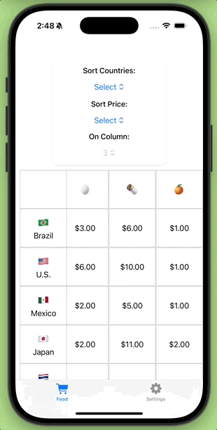

# 🍕🌍 SnackBucks : Global Food Price Comparison

Compare local food prices with those around the world, giving you a global perspective on costs, sourcing opportunities, and value differences.

Stay ahead of the game, source smarter, and discover where your favorite ingredients are most affordable!

  

---

## 🚀 Key Features

### 📊 Track Price Differences  
Monitor how food prices change over time across different regions to identify trends and make data-driven decisions.

### 🌐 Explore International Markets  
Explore international markets to discover where your favorite ingredients are most affordable and accessible.

### 💱 Switch Between Currencies  
Effortlessly switch between currencies for accurate, real-time global price comparisons.

### 🔍 Sort Prices Effortlessly  
Sort by cost or country to instantly find the best deals—no matter where you are.

### 🌎 Compare Globally  
See at a glance how your local prices stack up against those around the world.

---

## 🛠 Use Cases

- **Grocery Shoppers**: Compare prices for your ingredients, locally or globally.  
- **Travelers & Digital Nomads**: Budget your meals better by understanding regional food costs.  
- **Researchers & Economists**: Analyze food price trends across global markets.

---

## Download for iOS

  

---

## License

SnackBucks is under the MIT license. See the accompanying [LICENSE](LICENSE) for more information.

---

##  🔧 Build
Can build the app with a Mac station, Xcode and a free developer account : [Create a Free Apple Developer account](https://www.appypie.com/blog/how-to-create-a-free-apple-developer-account)

Then Xcode will let you side-load to your iPhone. When you’ve forked the repo to make your own app, you can do a yearly subscription as an Apple Developer to publish to the Appstore. 

---

## 📚🖲️ Coding Editors 
To develop this app with your own topic or theme, there are a couple of A.I. tools to assist you along the way.  Cursor and Windsurf are A.I. based coding tools you can pull up alongside (vibe) your coding application like Xcode or Android Studio to add more screens, buttons, field elements and features for your app. 

Cursor A.I. coding tool : 
[Cursor](https://www.cursor.com)

Windsurf A.I. coding tool : 
[Windsurf](https://windsurf.com)

---

## 🤝 Contributing

We welcome 👩🏾‍💻👨🏾‍💻 additions! If you’d like to help improve or expand this project, feel free to open an issue or submit a pull request.

---

## 📬 Contact

For feedback or questions feel free to [message](mailto:leapdeck1@gmail.com) for assistance.

